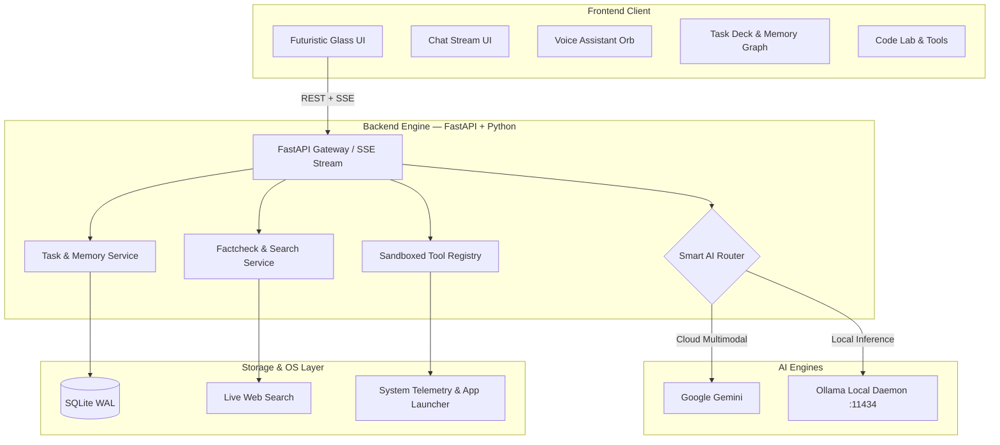

<div align="center">

# 🌐 WEB — AI Assistant
### *Your AI. Your Interface. Your Intelligence.*

<p align="center">
  A modern, full-stack personal AI assistant combining conversational intelligence, real-time voice interaction, web research & fact-checking, productivity tools, developer utilities, and a sleek futuristic glassmorphic interface.
</p>

<p align="center">
  <strong>Think. Listen. Understand. Assist.</strong>
</p>

[](https://fastapi.tiangolo.com)
[](https://python.org)
[](https://aistudio.google.com)
[](https://ollama.com)
[](LICENSE)
[](#-installation)

<p align="center">
  <a href="#-overview">Overview</a> •
  <a href="#-features">Features</a> •
  <a href="#-interface--visual-states">Interface</a> •
  <a href="#-architecture">Architecture</a> •
  <a href="#-installation">Installation</a> •
  <a href="#-configuration">Configuration</a> •
  <a href="#-security--privacy">Security</a> •
  <a href="#-roadmap">Roadmap</a>
</p>

---

</div>

## 🌌 Overview

**WEB** is more than a simple chatbot. It is engineered as a personal AI workspace that understands natural-language requests, responds through text and voice, assists with everyday tasks, and delivers an immersive futuristic AI experience.

The project is built around three core pillars:

| Pillar | Purpose |
| :--- | :--- |
| 🧠 **Intelligence** | Context-aware, multimodal AI reasoning powered by Google Gemini and local Ollama models. |
| 🎙️ **Interaction** | Natural voice-in/voice-out communication with audio-reactive visual states. |
| ✨ **Experience** | A dark cinematic glassmorphic interface with smooth Canvas-based animations. |

---

## 🚀 Features

### 🧠 1. AI Conversation Engine
- Natural-language understanding with conversation context retention.
- Multimodal support for images, PDF, CSV, TXT, and code snippets.
- **Dual AI provider routing**:
  - ☁️ **Cloud AI**: Google Gemini 2.5 Flash / 3.7 Flash.
  - 🖥️ **Local AI**: Ollama models such as `llama3.2`, `mistral`, and `deepseek-r1`.
  - 🔀 **Smart auto-router**: Provider selection, fallback, and health monitoring.

---

### 🎙️ 2. Advanced Voice Mode & AI Orb
- Hands-free, speech-driven interaction.
- Speech-to-text (STT) with Voice Activity Detection (VAD).
- Neural Text-to-speech (TTS) with seamless playback.
- Real-time animated AI Orb with concentric rings, particle orbits, and audio-reactive ripples.

---

### 🔎 3. Web Research & Fact-Checking Lab
- Live web search for current-information workflows.
- Concurrent multi-source claim evaluation.
- Evidence classification: `Verified`, `Mostly Verified`, `Partially Verified`, and `Conflicting`.
- Source-aware responses with transparent confidence indicators and cited source URLs.

---

### 📋 4. Productivity & Task Intelligence
- Natural-language task creation (*"Remind me to update the project documentation tomorrow"*).
- Priority and due-date tracking with filterable status toggles.
- SQLite WAL mode persistence.
- Task-board style interactive management.

---

### 🪐 5. Constellation Memory Matrix
- Persistent knowledge graph for saved preferences, identities, projects, and contextual memory.
- Interactive HTML5 Canvas visualization.
- Force-directed 2D node simulation with clickable relationship inspection.

---

### 💻 6. Code Lab Workbench
A developer-focused workspace with AI-assisted actions:
- 📖 **Explain Code** — understand architecture and logic.
- 🛠️ **Debug & Fix** — identify root causes and propose fixes.
- 🔄 **Refactor & Optimize** — improve structure, performance, and security.
- Syntax-highlighted code editing.

---

### 🛡️ 7. System Controls & Tool Sandboxing
- Real-time CPU, memory, disk, and platform diagnostics.
- Controlled application launching (Browser, Terminal, Notepad, Google, YouTube, custom tools).
- Permission gates for sensitive actions with `SAFE` vs `CONFIRM_REQUIRED` execution tiers.
- *System-level features depend on the operating system, permissions, and the tools enabled in your installation.*

---

## 🎨 Interface & Visual States

WEB uses a futuristic cinematic design language featuring dark glassmorphism, cyan/blue/purple accent lighting, responsive micro-animations, Canvas particle physics, and audio-reactive waveforms.

### Central AI Orb State Machine

```
    ┌───────────────────────────┐
    │           IDLE            │  Ambient halo + slow breathing particles
    └─────────────┬─────────────┘
                  │
                  ▼
    ┌───────────────────────────┐
    │      READY TO LISTEN      │  Concentric rings lock into active awaiting state
    └─────────────┬─────────────┘
                  │
                  ▼
    ┌───────────────────────────┐
    │         LISTENING         │  Live audio-reactive input waveform
    └─────────────┬─────────────┘
                  │
                  ▼
    ┌───────────────────────────┐
    │        PROCESSING         │  High-velocity particle orbits during AI reasoning
    └─────────────┬─────────────┘
                  │
                  ▼
    ┌───────────────────────────┐
    │         SPEAKING          │  Voice-reactive acoustic wave output
    └─────────────┬─────────────┘
                  │
                  ▼
           READY TO LISTEN
```

---

## 🎙️ Voice Assistant Flow

```
User Activates Voice Mode
           ↓
     AI Orb Appears
           ↓
  Microphone Activates
           ↓
   Speech is Captured
           ↓
   Speech → Text (STT)
           ↓
Gemini / Ollama Processes Request
           ↓
   Response Stream Generated
           ↓
   Text → Speech (TTS)
           ↓
AI Orb Speaks & Animates Waveforms
```

---

## 🏗️ Architecture



---

## 🧰 Technology Stack

### Frontend
- HTML5, CSS3, Modern ES6+ JavaScript
- HTML5 Canvas (60 FPS particle physics), SVG effects
- CSS Grid / Flexbox, Vanilla CSS glassmorphic tokens
- Web Speech API (STT & TTS), Web AudioContext (VAD)

### Backend
- Python 3.10+
- FastAPI & Uvicorn ASGI with Server-Sent Events (SSE) streaming
- SQLite3 with WAL mode
- HTTPX, BeautifulSoup4, DuckDuckGo Search
- Pydantic v2, PyPDF, Pillow, psutil

### AI Providers
- **Google Gemini API**: `gemini-2.5-flash`, `gemini-3.7-flash` (multimodal & vision)
- **Ollama**: Local private inference with `llama3.2`, `mistral`, and `deepseek-r1`

---

## 📁 Project Structure

```
ai/
├── backend/                      # Python FastAPI backend core
│   ├── ai/                       # Gemini, Ollama & smart routing
│   ├── api/                      # REST & SSE route endpoints
│   ├── database/                 # SQLite connection & schemas
│   ├── memory/                   # Memory & knowledge graph engine
│   ├── services/                 # Assistant, search & fact-checking
│   ├── tools/                    # Tool registry & system controls
│   ├── config.py                 # Environment configuration loader
│   └── main.py                   # FastAPI application initialization
│
├── frontend/                     # Modern dark web client
│   ├── css/                      # UI styles (main, core, chat, components)
│   ├── js/                       # Chat, voice, memory & visualizer controllers
│   └── index.html                # Main command deck interface
│
├── data/                         # Persistent SQLite data & graph nodes
├── uploads/                      # User-uploaded documents & images
├── run.py                        # Master startup script with banner & auto-launch
├── WEB_AI_OS.spec                # PyInstaller build configuration
├── requirements.txt              # Python dependencies
├── .env.example                  # Environment template
├── .gitignore                    # Git ignore file
├── LICENSE                       # MIT License
└── README.md                     # Project documentation
```

---

## ⚙️ Installation

### Requirements
Before starting, make sure you have:
- Python 3.10 or newer
- Git
- A supported modern web browser
- At least one configured AI provider:
  - **Google Gemini** (API Key), or
  - **Ollama** with a local model installed

---

### 1. Clone the Repository
```bash
git clone https://github.com/pranavchoudharybhl-svg/ai.git
cd ai
```

### 2. Create a Virtual Environment
```bash
# Windows
python -m venv venv
venv\Scripts\activate

# macOS / Linux
python3 -m venv venv
source venv/bin/activate
```

### 3. Install Dependencies
```bash
pip install -r requirements.txt
```

### 4. Configure Environment Variables
Create your local environment file:

```bash
# Linux / macOS
cp .env.example .env

# Windows PowerShell
Copy-Item .env.example .env
```

Edit `.env` with your preferred configuration:
```env
# Google Gemini (Cloud)
GEMINI_API_KEY=your_gemini_api_key_here
GEMINI_MODEL=gemini-2.5-flash

# Ollama (Local / Optional)
OLLAMA_HOST=http://127.0.0.1:11434
OLLAMA_MODEL=llama3.2:latest

# Provider: auto | gemini | ollama
ACTIVE_PROVIDER=auto

# Server settings
HOST=127.0.0.1
PORT=8000
```

### 5. Start WEB
```bash
python run.py
```
> The startup script will initialize the server, display system telemetry, and automatically launch the application in your default browser at **`http://127.0.0.1:8000`**.

---

## 🔧 Configuration

| Variable | Description | Default | Required |
| :--- | :--- | :--- | :--- |
| `GEMINI_API_KEY` | Google Gemini API key | `""` | Optional* |
| `GEMINI_MODEL` | Cloud Gemini model tag | `gemini-2.5-flash` | Optional |
| `OLLAMA_HOST` | Ollama server endpoint | `http://127.0.0.1:11434` | Optional* |
| `OLLAMA_MODEL` | Local model tag | `llama3.2:latest` | Optional |
| `ACTIVE_PROVIDER` | `auto`, `gemini`, or `ollama` | `auto` | Optional |
| `HOST` | Local server host | `127.0.0.1` | Optional |
| `PORT` | Local server port | `8000` | Optional |
| `TTS_ENGINE` | Speech synthesis engine | `browser` | Optional |

*\*At least one AI provider should be available for AI interactions.*

---

## 🔐 Security & Privacy

Security and privacy are core parts of the project architecture:
- 🔑 **Server-Side API Key Protection**: API keys remain strictly on the backend and are never exposed to frontend code.
- 📁 **File Sandboxing**: File operations are restricted to the workspace directory to prevent path traversal.
- 🛡️ **Controlled Tool Execution**: Sensitive actions require interactive confirmation modals before execution.
- 🗄️ **SQLite WAL Mode**: High-concurrency local database storage without thread lock issues.
- 💻 **Local-First Capability**: Ollama provides 100% private local inference without sending prompts to cloud providers.

> [!NOTE]
> *Privacy depends on your configuration. If you enable Gemini or web-search features, relevant requests are sent to those external services. Review your provider settings before describing the application as fully offline.*

---

## 🧩 Extending WEB

WEB is designed to be modular so developers can easily add skills, tools, and provider integrations.

### Example: Registering a Custom Tool
```python
from backend.tools.registry import register_tool

@register_tool(
    name="custom_system_action",
    description="Performs a custom authorized system action",
    requires_confirmation=True  # Security gate
)
async def custom_system_action(parameter: str) -> dict:
    # Your execution logic here
    return {
        "status": "success",
        "result": f"Executed with {parameter}"
    }
```

---

## 📦 Building a Standalone Application

The repository includes a PyInstaller specification: [`WEB_AI_OS.spec`](WEB_AI_OS.spec).

### For Release Builds:
- Build separately for each operating system using the included build scripts (`build_windows.bat`, `build_linux.sh`, `build_mac.sh`) or the automated [GitHub Actions Workflow](.github/workflows/build-releases.yml).
- Never place API keys inside the executable bundle.
- Test voice, browser access, filesystem permissions, and system tools on the target OS.
- Keep provider credentials in user-controlled `.env` configuration.
- *A Windows `.exe` is not directly portable to Linux or macOS. Cross-platform desktop releases require OS-specific builds.*

---

## 🗺️ Roadmap

### ✅ Completed
- [x] Futuristic dark cinematic interface with glassmorphism
- [x] 60 FPS Canvas particle core with audio-reactive waveforms
- [x] Google Gemini + Ollama dual-provider routing with smart fallback
- [x] Multi-source fact verification workflow with confidence scoring
- [x] Conversational voice mode (STT + TTS + VAD)
- [x] Natural-language task scheduler & board
- [x] Constellation memory graph visualization
- [x] Developer Code Lab workbench
- [x] Sandboxed tool execution with permission confirmation modals
- [x] Standalone PyInstaller Windows executable build

### 🔄 In Development
- [ ] Vision-assisted screen understanding & document OCR
- [ ] Wake word detection — *"Hey WEB"*
- [ ] Multimodal voice-to-voice streaming
- [ ] Expanded custom skill/plugin system
- [ ] Long-term semantic vector memory (RAG)

### 🔮 Future Ideas
- [ ] Mobile PWA companion
- [ ] Gesture-based webcam controls
- [ ] Multi-agent collaborative workflows
- [ ] Scheduled background routines
- [ ] Additional platform-specific desktop builds

---

## 📸 Screenshots & Demo

<div align="center">

| Main Command Deck | Voice Assistant Mode |
| :---: | :---: |
| *(Futuristic AI Core & Chat Stream)* | *(Live Waveform & Animated Orb)* |

| Fact-Checking Lab | Constellation Memory Matrix |
| :---: | :---: |
| *(Multi-Source Evidence & Confidence)* | *(Interactive 2D Knowledge Graph)* |

</div>

---

## 🤝 Contributing

Contributions are welcome!

1. Fork the repository
2. Create a feature branch:
   ```bash
   git checkout -b feature/AmazingFeature
   ```
3. Commit your changes:
   ```bash
   git commit -m "Add: AmazingFeature"
   ```
4. Push to the branch:
   ```bash
   git push origin feature/AmazingFeature
   ```
5. Open a Pull Request

*Please keep security-sensitive functionality permission-aware and document new tools or configuration variables.*

---

## 🐛 Issues & Feature Requests

Found a bug or have an idea? Open a GitHub issue and include:
- A clear description
- Steps to reproduce
- Operating system & Python version
- Browser version (when relevant)
- Relevant log output or screenshots

---

## 📜 License

This project is licensed under the [MIT License](LICENSE) — see the [LICENSE](LICENSE) file for details.

---

## ⭐ Support the Project

If you find WEB useful or interesting:
- ⭐ **Star the repository on GitHub**
- 🐛 **Report bugs & suggest features**
- 📢 **Share the project with other developers and AI enthusiasts**

---

## 👨‍💻 Developer

**Pranav Choudhary**  
*Aspiring Web Developer • UI/UX Designer • AI Enthusiast*  
- GitHub: [@pranavchoudharybhl-svg](https://github.com/pranavchoudharybhl-svg)

<div align="center">

---

### 💙 WEB
*Think. Listen. Understand. Assist.*

*Built to explore the future of personal AI assistants, voice interaction, intelligent interfaces, and human-computer interaction.*

</div>
